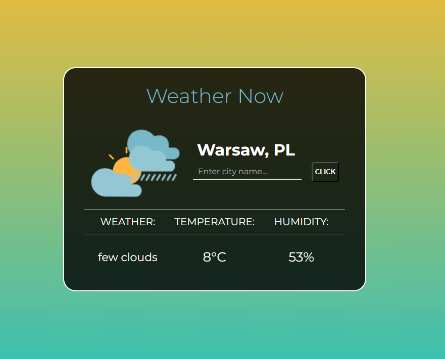

# 🗺️ DESCRIPTION
WeatherNow app showing the weather right now for cities around the world

# ▶️ DEMO
There is no demo. 
My lesson from this project was that there is no safe way to protect API_KEY and push project at GitHub.
Here is a screen shot:

# 📓 Technologies used
* REST API
* Vanilla JS
* CSS
* HTML

# 😊 Download and Install
* Use the link from the 'Clone or download' button to download the project.
* You need to register and add your private API_KEY from https://openweathermap.org/
